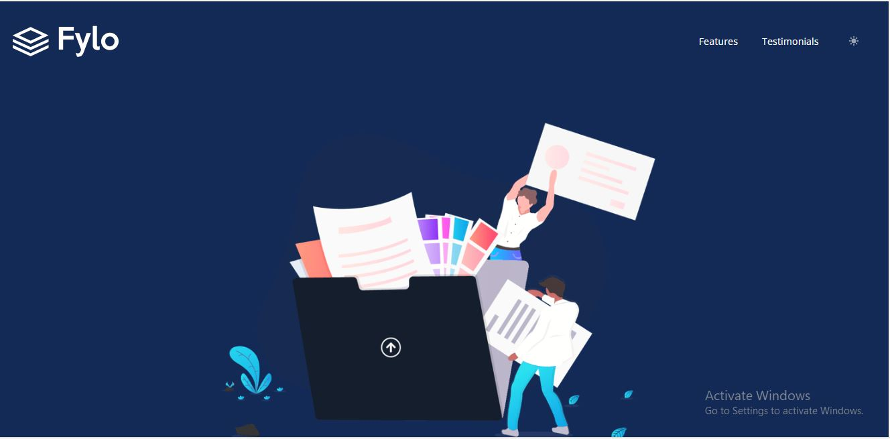
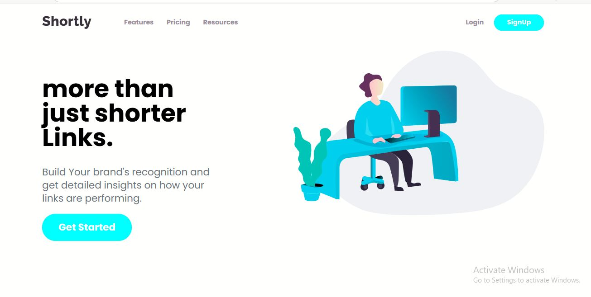

# Tailwind CSS Projects
This repository contains six Tailwind projects. Tailwind.css, which is used  with some JavaScript to provide the project's functionalities.  
These websites are for both desktop and mobile. Different screens have been used.

## project Portfolio
This is my personal portfolio site.To see more go to the portfolio project folder where I will include each and every screenshots. 
### Desktop version

# Bookmark website
This is a landing page of a Bookmark website. It has several sections. JavaScript is used for the tabs. In the project folder, each and every screnshots will be provided.

### Desktop version

# Fylo website
This is a landing page of the Fylo website. It has several sections. JavaScript has been used for the day and night mode. In the project folder, each and every screnshots will be provided.

### Desktop version

# shorly website
This is a landing page of the shortlink website. It has several sections. JavaScript has been used in the input section.  In the project folder, each and every screnshots will be provided.

### Desktop version

# clipboard website
This is a landing page of the clipboard website. It has several sections. In the project folder, each and every screnshots will be provided.

### Desktop version

# LoopStudio website
This is a landing page of the LoopStudio website. It has several sections. JavaScript has been used in the mobile section. In the project folder, each and every screnshots will be provided.

### Desktop version

