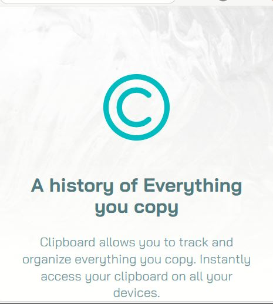

# Clipboard website
This is a landing page of the clipboard website. It has several sections. JavaScript has been used in the mobile section.

### Desktop version

 
 

# Mobile version
Here is the mobile version of the website. Everything works perfectly fine.in the top right corner we can see the mobile menu button. 

 

# Thumbs section
This is the VR section of the website. Relative div is used in this section so that the text overlays the picture.

 
 

# Supercharge Section
This is the supercharge section and was the most tough part of the website shadows, flex-box and other css properties were used in this section.

 
 

# Footer Section

This is the foooter section of the website. Flex-box and other CSS properties were used in this section.

 
 

