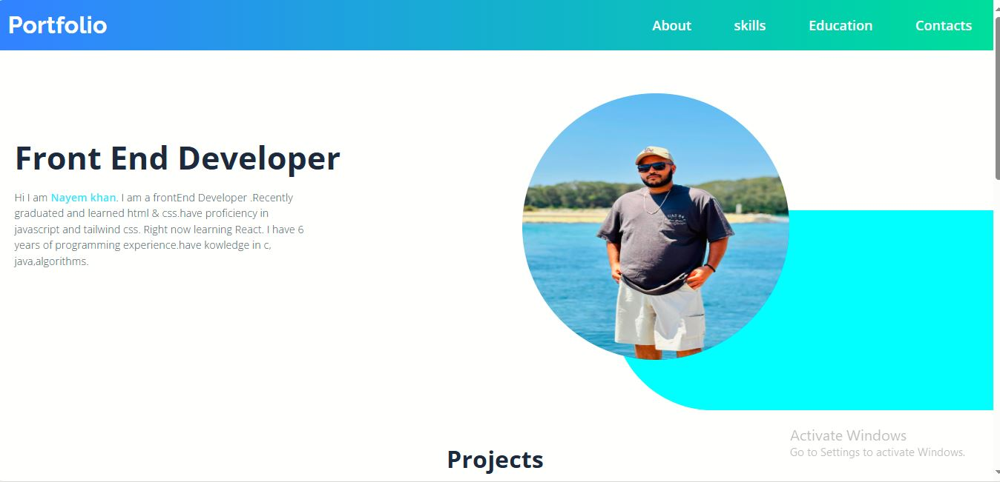

# LoopStudio website
This is my portfolio website. It has several sections. JavaScript has been used in the mobile and also in the Tab section.

### Desktop version

 
 

# Mobile version
Here is the mobile version of the website. Everything works perfectly fine.in the top right corner we can see the mobile menu button. 

 

# Tab section
This is the Tab section of the website. flexbox and javascript have been used.

 
 

# Footer Section

This is the foooter section of the website. Flex-box and other CSS properties were used in this section.

 
 

